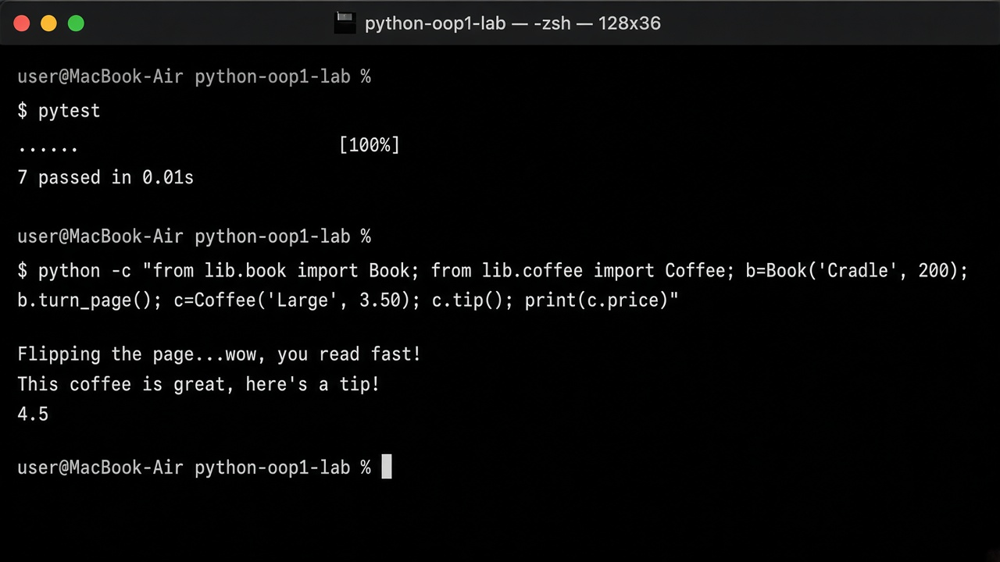

# Bookstore Models

A small Python project that models two things you would find in a bookstore: a **book** you can flip through and a **coffee** you can tip for.

## Features

- Create a `Book` with a title and page count
- Keep `page_count` as an integer (invalid values print a helpful message)
- Turn the page with `turn_page()`
- Create a `Coffee` with a size and price
- Allow only `Small`, `Medium`, or `Large` sizes
- Leave a tip with `tip()`, which adds $1 to the price

## Getting Started

You need Python 3.10+ and [Pipenv](https://pipenv.pypa.io/).

```bash
pipenv --python 3.10 install
pipenv shell
```

## Usage

```python
from lib.book import Book
from lib.coffee import Coffee

# Build a book, then turn a page
book = Book("And Then There Were None", 272)
print(book.title)       # And Then There Were None
print(book.page_count)  # 272
book.turn_page()        # Flipping the page...wow, you read fast!

# Build a coffee, then leave a tip
coffee = Coffee(size="Large", price=3.50)
print(coffee.size)      # Large
print(coffee.price)     # 3.5
coffee.tip()            # This coffee is great, here’s a tip!
print(coffee.price)     # 4.5
```

### Book

| Piece | What it does |
| --- | --- |
| `title` | The book's name. Required when you create the book. |
| `page_count` | How many pages the book has. Must be an integer. |
| `turn_page()` | Prints `Flipping the page...wow, you read fast!` |

If you set `page_count` to something that is not an integer, the program prints:

```text
page_count must be an integer
```

### Coffee

| Piece | What it does |
| --- | --- |
| `size` | Cup size: `Small`, `Medium`, or `Large`. Required when you create the coffee. |
| `price` | How much the drink costs. Required when you create the coffee. |
| `tip()` | Prints a thank-you message and adds `1` to `price`. |

If you set `size` to anything else, the program prints:

```text
size must be Small, Medium, or Large
```

## Running the Tests

This project is test-driven. The tests live in `lib/testing/`.

```bash
# Run every test
pytest

# Stop at the first failure (useful while you are still writing code)
pytest -x lib/testing/book_test.py
pytest -x lib/testing/coffee_test.py
```

## Completed Work


